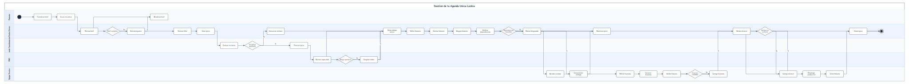

# Gestion de la Agenda Unica Luckia

## Metadata

| Campo | Valor |
| --- | --- |
| Area | Tecnologia / Transformacion |
| Fecha creacion | 2025-10-20 |
| Fecha entrada en vigor | Pendiente de confirmar |
| Version | 2.1 |
| Estado | Draft |

## Objetivo

Establecer un proceso unico y centralizado, la Agenda Unica Luckia, como canal exclusivo para trasladar, evaluar y gestionar todas las iniciativas tecnologicas y funcionales de la compania.

El proceso garantiza trazabilidad, control de capacidad y visibilidad transversal, alineando las decisiones del Comite de Transformacion con la ejecucion real de los equipos de desarrollo.

## Actores

| Actor | Responsabilidad |
| --- | --- |
| Promotor | Formaliza la necesidad y actualiza el brief cuando se requieren ajustes. |
| Product Owner | Revisa el brief, crea la epica, define features, verifica dependencias y valida alcance. |
| Comite Transformacion | Evalua, aprueba y prioriza las iniciativas. |
| PMO | Monitoriza capacidad, rango operativo e intake. |
| Equipo Tecnico | Refina historias, construye, valida, resuelve dependencias tecnicas y despliega. |

## Input

- Necesidad tecnologica o funcional promovida por Negocio, Producto o Tecnologia.
- Brief de Proyecto con descripcion, justificacion, objetivos, KPIs, alcance, effort, equipos implicados y dependencias.
- Capacidad disponible y planificacion vigente de los equipos.

## Output

- Epica registrada y trazable en Azure DevOps.
- Features definidas, estimadas, asignadas, validadas y cerradas.
- Historias, test suites y bugs vinculados a la jerarquia de trabajo.
- Epica cerrada tras validacion integrada y despliegue en produccion.

## Reglas

- Todas las iniciativas que impliquen desarrollo por parte de Tecnologia pasan por la Agenda Unica.
- No existe doble flujo para Portfolio y Mejora.
- Cada iniciativa debe formalizarse mediante un Brief de Proyecto.
- Toda la demanda planificada se registra en Azure DevOps.
- La priorizacion se realiza de fin a inicio, priorizando cierre antes que apertura.
- Cada equipo debe mantener entre uno y dos sprints planificados por delante del sprint en curso.
- Si un equipo supera dos sprints planificados, se congela el intake hasta liberar capacidad.
- El refinado no es continuo; se reanuda cuando la planificacion baja del umbral de un sprint.
- Las dependencias deben estar resueltas antes de avanzar a construccion.
- Una epica se cierra solo cuando todas sus features estan cerradas y desplegadas.

## Descripcion secuencial del flujo

### Fase 0: Recepcion y evaluacion inicial

1. El promotor formaliza la necesidad en un Brief de Proyecto.
2. El promotor envia la iniciativa al Product Owner.
3. El Product Owner revisa si el brief esta completo.
4. Si el brief no esta completo, el Product Owner solicita ajustes al promotor.
5. El promotor actualiza el brief y el Product Owner lo revisa de nuevo.
6. Cuando el brief esta completo, el Product Owner estima el effort.
7. El Product Owner crea la epica en Azure DevOps.
8. El Comite de Transformacion evalua la iniciativa.
9. Si la iniciativa se aprueba, el Comite prioriza la epica.
10. Si la iniciativa no se aprueba, el Product Owner comunica el rechazo.

### Fase 1: Definicion funcional y descomposicion

1. La PMO revisa la capacidad y el rango operativo del equipo.
2. Si el rango operativo no es adecuado, la PMO congela el intake.
3. El Product Owner concentra el trabajo en cerrar actividad activa hasta liberar capacidad.
4. Con capacidad disponible, el Product Owner define las features.
5. El Product Owner estima y asigna las features.
6. El Product Owner verifica las dependencias identificadas.

### Fase 2: Construccion y validacion funcional

1. Si existen dependencias sin resolver, el Product Owner marca la epica como bloqueada.
2. El Equipo Tecnico acuerda el contrato necesario para la integracion.
3. El Equipo Tecnico compromete el horizonte de entrega.
4. El Product Owner reactiva la epica cuando las dependencias quedan resueltas.
5. El Equipo Tecnico refina las historias.
6. El Equipo Tecnico construye las historias.
7. El Equipo Tecnico valida las features.
8. Si las features no estan cerradas, el Equipo Tecnico corrige historias y repite la validacion.

### Fase 3: Validacion integrada y despliegue

1. El Product Owner valida el alcance entregado.
2. Si la validacion no es correcta, el Equipo Tecnico corrige el alcance.
3. El Product Owner repite la validacion del alcance.
4. Cuando la validacion es correcta, el Equipo Tecnico despliega en produccion.
5. El Equipo Tecnico cierra las features.
6. El Product Owner cierra la epica.

## Diagrama de proceso

## Caminos alternativos

- Brief incompleto: el Product Owner solicita ajustes y el promotor actualiza el brief antes de continuar.
- Iniciativa rechazada: el Comite no aprueba la iniciativa y el Product Owner comunica el rechazo.
- Rango operativo no valido: la PMO congela el intake y el Product Owner prioriza cerrar trabajo activo.
- Dependencias no resueltas: la epica se bloquea hasta acordar contrato y compromiso de entrega.
- Features no cerradas: el Equipo Tecnico corrige historias y repite la validacion funcional.
- Validacion integrada incorrecta: el Equipo Tecnico corrige el alcance y el Product Owner valida de nuevo.

## Excepciones

- Si una dependencia critica no tiene contrato ni compromiso de implementacion, la epica permanece en estado `Blocked`.
- Si el equipo tiene menos de un sprint planificado, existe riesgo de vacio operativo y se debe reactivar el refinado.
- Si el equipo tiene mas de dos sprints planificados, existe sobreplanificacion y se congela el intake.
- Las mejoras tecnicas promovidas por Tecnologia no quedan exentas del proceso: deben documentarse, presentarse al Comite y recorrer todas las fases.
- Una epica no puede cerrarse si quedan features abiertas o pendientes de despliegue.
