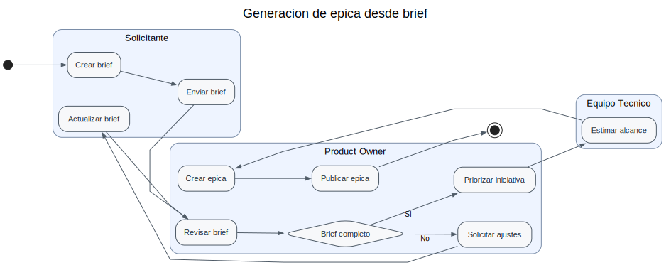

# Generacion de epica desde brief

Este proceso ilustra la conversion de un brief inicial en una epica lista para priorizar.

## Artefactos

- Modelo fuente: `process.yaml`
- SVG renderizado: `process.svg`

## Diagrama de proceso

[Abrir o imprimir el diagrama a mayor tamaño](process.svg)

## Actualizacion

1. Modificar `process.yaml` si cambia la logica del proceso.
2. Ejecutar `make diagrams`.
3. Verificar con `make validate-diagrams`.
4. Incluir el modelo y el SVG en el commit.
